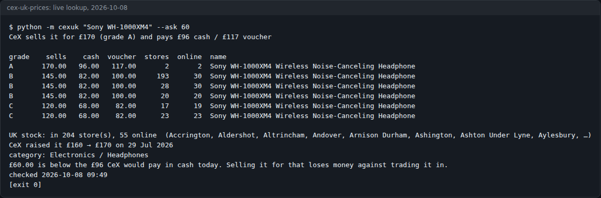
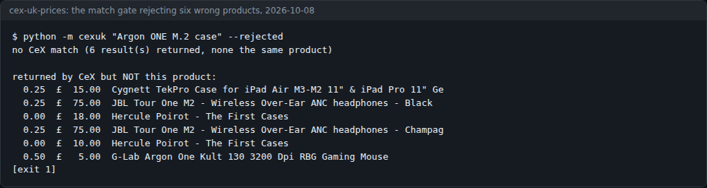
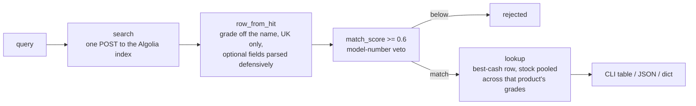

# cex-uk-prices

CeX UK retail and trade-in prices from Python: what CeX **sells** an item for, what it **pays in cash**, what it **pays in vouchers**, which UK stores hold it, and which way CeX last moved the price.



[](LICENSE)


Standard library only. No key, no account, no browser. Not affiliated with CeX; read [Etiquette and terms](#etiquette-and-terms) before you point this at anything.

Write-up on dev.to: [CeX offered £136 cash for my £30 Pi case. It was quoting a different product.](https://dev.to/c1-anderson/cex-offered-ps136-cash-for-my-ps30-pi-case-it-was-quoting-a-different-product-55j0)

## Contents

- [What it does](#what-it-does)
- [Screenshots](#screenshots)
- [Quick start](#quick-start)
- [Usage](#usage)
- [Configuration](#configuration)
- [How it works](#how-it-works)
- [The traps](#the-traps)
- [Status, limits and real results](#status-limits-and-real-results)
- [Etiquette and terms](#etiquette-and-terms)
- [Licence and credits](#licence-and-credits)

## What it does

- Looks an item up in CeX's own public UK search and returns sell, cash and voucher prices, all taken from the **same** row (the best cash offer).
- Scores every row against your query and throws away rows that are a different product (`match_score`, threshold 0.6, with a model-number veto). `--rejected` shows what was thrown away.
- Reads the grade (A, B, C) off the product name and treats grades of one product as one product.
- Pools UK store stock and online quantity across the grades of that product, and reports CeX's last price move ("CeX raised it £160 → £170 on 29 Jul 2026").
- Says "it will not buy this one" when the cash price is £0, instead of "trade in for £0".
- With `--ask`, warns when your asking price is below what CeX would pay in cash today.
- Never turns a failure into a price: a failed request returns no rows and no `cash` key, and the CLI exits 1.

## Screenshots

| | |
|---|---|
|  |  |
| `python -m cexuk "Sony WH-1000XM4" --ask 60`, run live on 2026-10-08. | `python -m cexuk "Argon ONE M.2 case" --rejected`, run live on 2026-10-08: CeX returned six rows (two Poirot DVDs, an iPad case, JBL headphones, a mouse), none of them the product, so the CLI exits 1. |

## Quick start

You need Python 3.10 or newer. There is nothing to install.

```bash
git clone https://github.com/casareanderson/cex-uk-prices
cd cex-uk-prices
python -m unittest discover -s tests -t .    # 17 tests, no network
python -m cexuk "Sony WH-1000XM4"
```

Success looks like the screenshot above: a one-line summary, a table with one row per grade, UK stock, and `checked <date time>`.

## Usage

From the command line:

```bash
python -m cexuk "Sony WH-1000XM4"                  # table
python -m cexuk "Sony WH-1000XM4" --ask 60         # is my price below CeX's cash offer?
python -m cexuk "Argon ONE M.2 case" --rejected    # see what the match gate threw away
python -m cexuk "Sony WH-1000XM4" --json           # everything, machine-readable
python -m cexuk "Sony WH-1000XM4" --limit 10       # ask CeX for more rows (default 6)
```

The exit code is 0 on a match and 1 on no match, so a script can tell "no answer" from "£0".

From Python:

```python
import cexuk

r = cexuk.lookup("Xiaomi Mi TV Box S 3rd Gen")
r["sell"], r["cash"], r["voucher"]    # (60.0, 26.0, 37.0) on 2026-09-13
r["price_move"]                       # 'CeX raised it £55 → £60 on 29 Aug 2026'
```

| Function | Returns |
|---|---|
| `lookup(query, limit=6)` | dict: `rows`, `rejected`, and on a match `sell` `cash` `voucher` `cash_pct` `voucher_pct` `grade` `product` `products` `stores` `online_qty` `price_move` `discontinued` `category` `checked` `note` |
| `search(query, limit=6)` | raw UK `Row`s, **not** relevance-checked |
| `row_from_hit(dict)` | one Algolia hit → `Row` |
| `match_score(query, title)` | 0.0–1.0 |
| `price_move(row)` | `"CeX raised it £55 → £60 on 29 Aug 2026"` or `""` |
| `floor_warning(ask, cash)` | a sentence when your ask is below CeX's cash offer |

## Configuration

There are no environment variables or config files. The settings are module constants:

| Name | Default | What it does |
|---|---|---|
| `client.SEARCH` | `https://search.webuy.io/1/indexes/*/queries` | The Algolia endpoint CeX's search box uses |
| `client.INDEX` | `prod_cex_uk` | The UK index |
| `client.UA` | `cex-uk-prices/0.1.0 (+https://github.com/casareanderson/cex-uk-prices)` | User-Agent. Change it to name **your** program if you build on this. |
| `client.MIN_INTERVAL` | `1.0` seconds | Minimum gap between requests from one process |
| `client.TIMEOUT` | `20` seconds | Request timeout |
| `client.ORIGIN` | `UK` | Rows from any other origin are dropped |
| `match.MIN_MATCH` | `0.6` | Score a row needs to count as the product you asked about |

## How it works

`uk.webuy.com` sits behind bot protection and returns 403 to a server. This does **not** try to get past that. The site's own search box queries an [Algolia](https://www.algolia.com/) index, and that index answers a plain request with the same rows the website shows:

```bash
curl -s https://search.webuy.io/1/indexes/*/queries \
  -H 'Content-Type: application/json' \
  -A 'your-program/1.0 (+https://example.com)' \
  -d '{"requests":[{"indexName":"prod_cex_uk","params":"query=Sony%20WH-1000XM4&hitsPerPage=6"}]}'
```

One POST and a JSON body, with no key and no cookies. It answers an honest User-Agent; you don't need to pretend to be a browser.



### What the fields mean

Measured against the live UK index on 13 September 2026. Only the fields worth reading are listed.

| Field | What it is | Watch out for |
|---|---|---|
| `boxName` | Product name **with the grade on the end** | See trap 2 |
| `boxId` | `<product code><grade letter>` | `…117A`, `…117B`, `…117C` are **one** product |
| `sellPrice` | What CeX **retails** it for | An asking price. Nobody paid it. |
| `cashPriceCalculated` | What CeX **pays you in cash** today | `0` means CeX **won't buy it**, not that it's worthless |
| `exchangePriceCalculated` | What CeX pays in **store credit** | Not money. Usually higher than cash, and that's the point. |
| `buyPerc` / `exchangePerc` | Cash and voucher as **% of retail** | This *is* the trade-in formula: WH-1000XM4 £145 × 57% = £82 |
| `firstPrice` | Launch retail | |
| `previousPrice`, `priceLastChanged` | Retail before the last change, and when | **Missing on some rows** |
| `stores` | UK stores holding **this grade** | Empty list = none. Can be 170+ names. |
| `outOfStock` | Stores that don't | |
| `ecomQuantity` | Units CeX holds online | |
| `categoryName`, `superCatName` | e.g. `Headphones`, `Electronics` | |
| `discontinued` | `1` when CeX has discontinued it | Usually why the cash price is 0 |
| `origin` | `UK` | Checked on every row; anything else is dropped |
| `boxBuyAllowed` | **Not** "CeX will buy this" | See trap 4 |

```
cex-uk-prices/
├── cexuk/
│   ├── client.py     the request, Row parsing, lookup(), price_move(), floor_warning()
│   ├── match.py      match_score() and the 0.6 threshold
│   └── __main__.py   the CLI
├── tests/test_cexuk.py   17 offline tests on real-shaped fixtures
└── docs/                 README screenshots
```

## The traps

Each of these produced a wrong answer in a real pricing tool before it was caught.

**1. The search always answers, even when it's the wrong product.** Algolia is fuzzy. Ask about something CeX doesn't stock and you get confident prices for something else. Measured 12 September 2026:

| Query | CeX returned |
|---|---|
| Raspberry Pi Argon ONE with SSD | Raspberry Pi 500+, with a **£136 cash** offer |
| Argon ONE M.2 case | *Hercule Poirot: The First Cases* (a DVD), an iPad case, JBL headphones |
| Casio FX-CG50 Graphing Calculator | FX-CG20 / FX-CG500 / FX-CG10 |

Take "the best cash offer on the page" from that and you have told someone to trade in a £30 Pi case because CeX pays £136, based on a different product. So `lookup()` scores every row against the query first, and only rows at **0.6 or above** count. The threshold was measured, not chosen: genuine matches scored 0.62 (Nest Mini), 0.67 (WH-1000XM4) and 0.86 (Xiaomi TV Box 3rd Gen), and every wrong product scored at most 0.50. The model number is a veto rather than a vote, so `FX-CG50` never matches `FX-CG20`.

**2. The grade is part of the name.** `"…Headphones - Black, B"` is grade B. It isn't always after a comma: `"Apple iPhone 13 128GB Midnight, Unlocked B"` is grade B with the comma three words earlier. Each grade is its own row at its own price, and `boxId` ends in the grade letter. Three rows for A/B/C are one product, not three pieces of evidence.

**3. A cash price of £0 means "won't buy", not "worthless".** The Google Nest Mini (2nd Gen) retailed at £35 with a cash price of £0. Report that as "trade in for £0" and you've made a false statement about a real shop.

**4. `boxBuyAllowed` doesn't tell you whether CeX will buy it.** That same Nest Mini had `boxBuyAllowed: 1`, a £0 cash price and `discontinued: 1`. The refusal is in the cash price, and the reason is `discontinued`. `boxBuyAllowed` isn't read.

**5. Voucher isn't cash.** CeX typically pays more in credit (69%) than in money (57%). Adding them, or comparing the voucher figure with an eBay sale, turns "I sold a thing" into "I've committed to shopping at CeX".

**6. Keep the numbers on one row.** `max(cash)` captioned with the first row's `buyPerc` labels one grade's money with another grade's ratio. `lookup()` takes sell, cash, voucher and both percentages from the single best-cash row.

**7. A failed request must not look like zero.** Every network or parse failure returns no rows, and `lookup()` then has no `cash` key at all.

**8. Rows aren't uniform.** Some have no `priceLastChanged`, `previousPrice` or `stores`. Every optional field is parsed defensively.

## Status, limits and real results

Working as of **2026-10-08**: the live lookup in the screenshot above returned 6 graded rows, stock in 204 UK stores and 55 online, and the same £96 cash / £117 voucher offer as the 13 September run. The 17 tests pass offline.

- **Undocumented endpoint.** It is not an official API: no documentation, no contract and no versioning. It changes whenever CeX's front end changes. The older public CeX API (`wss2.cex.uk.webuy.io/v3/boxes`), which earlier open-source scrapers used, now returns 403 to search. Anything built on this should keep working when it disappears.
- **UK only** (`prod_cex_uk`).
- **The match gate is word overlap with a model-number veto**, not understanding. A short title that shares most of your query's words can reach 0.6 without being the same product. Long, specific queries do best. It has been measured on electronics, not on games or films.
- **Stock is a snapshot.** `checked` records when it was read.
- **Prices describe CeX's stock and CeX's margins**, not the wider second-hand market. A shop's retail price is not what things sell for.

## Etiquette and terms

- **Not affiliated with CeX.** This reads the same public search the website runs for every visitor. CeX's own terms and conditions apply to you; read them before building anything on this, and don't use it for anything they forbid.
- **Say who you are.** The default User-Agent names this project and links here. Change it to name your program if you build on it.
- **Be slow.** At most one request per second from a process, one request per lookup, no retries. This keeps working only while it looks like ordinary use.
- **Don't try to get past the storefront's bot protection.** If the search index ever stops answering an honest client, treat that as the answer.

## Licence and credits

MIT, see [LICENSE](LICENSE).

Price and stock data belong to CeX and come from its public search, which runs on Algolia. Extracted from a private eBay listing tool, where CeX's cash price is the one number that isn't an opinion: a standing offer to buy the item today, so it works as a floor under an asking price and as the answer to "trade it in, or list it?".
